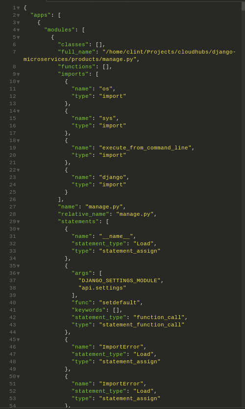
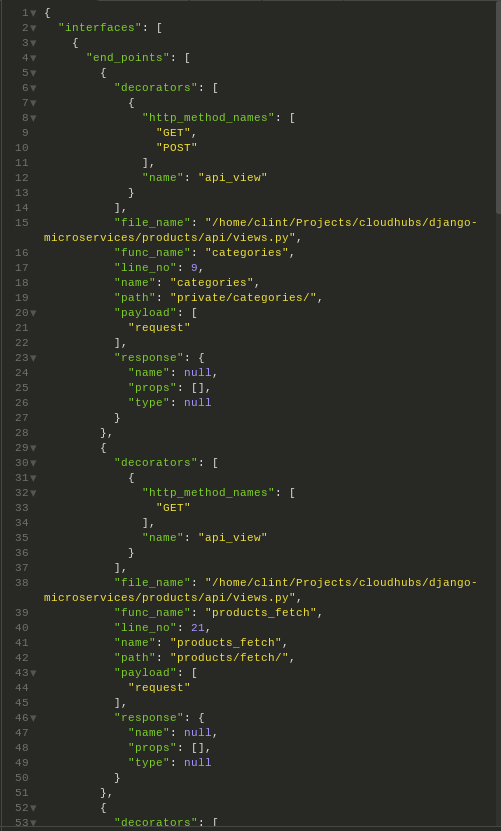

# py-parser

Python Source Code Parser

## How To Install:
1. Create a local virtual environment for the project to prevent polluting your environment:
Run this command in the project directory:
    ```shell script
     python3 -m venv venv
   ```
   
2. Activate the venv:
  ```shell script
     source venv/bin/activate
  ```

3. Install required dependencies in the virtual environment
  ```shell script
    pip install -r requirements.txt
  ```

4. Run flask application
```shell script
  export FLASK_APP=src/app
  flask run
```
    
    
5. Test that application is running: Assuming the project we
```shell script
curl --request GET --url http://localhost:5000
```

6. Run Sample Demo Project/Test Bed

First clone the Test Bed Project:
```shell script
  git clone https://github.com/clintonyeb/django-microservices
```

You can test the various interfaces for this project as following:


i. Parse A Python project as System, Apps, Modules, etc..: Available at the `parse` endpoint

```shell script
  curl --request POST \
  --url http://localhost:5000/parse \
  --header 'content-type: application/json' \
  --data '{
	"fileName": "/home/clint/Projects/cloudhubs/django-microservices"
}	'
```

This will generate the various nodes of the project.

#### Response Sample:

A JSON sample response is included in the `docs` folder: `docs/parser.json`




ii. Parse A Python project for various end points and rest calls: Available at the `interface` endpoint

```shell script
  curl --request POST \
  --url http://localhost:5000/interface \
  --header 'content-type: application/json' \
  --data '{
	"fileName": "/home/clint/Projects/cloudhubs/django-microservices"
}	'
```

This will generate the various end points and exit points of the project.

NB: `Exit Point`: refers to Rest Calls from a project to another.
`End Point` refers to the various end points of a project available to be called from other projects.

#### Response Sample:

A JSON sample response is included in the `docs` folder: `docs/interface.json`




iii. Generate `MsModel` Data Structure

The logic to reconstruct the PyParser data into MsModel structure is contained in `prophet-utils` module.

It also has a rest interface at the `prophet` module.

You have to clone and setup the [CloudHubs Prophet Module](https://github.com/cloudhubs/prophet). Check its README for instructions on how to setup.

Now you can generate the MsModel data structure at the following endpoint: ``:

Example: 

```shell script
  curl --request POST \
  --url http://localhost:8080/py/interface \
  --header 'content-type: application/json' \
  --data '{
	"fileName": "/home/clint/Projects/cloudhubs/django-microservices"
}	'
```

#### Response Sample:
